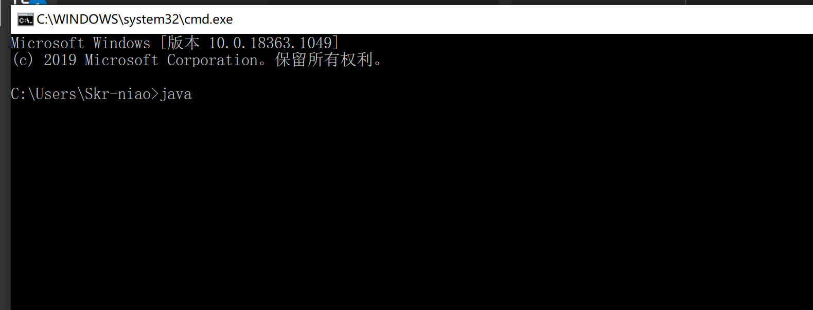
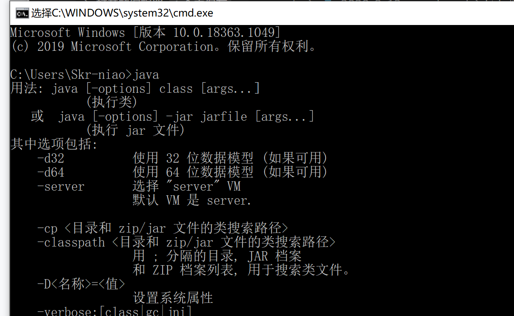
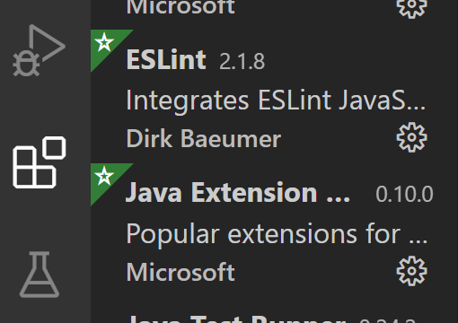
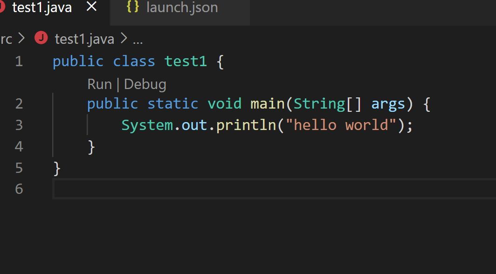
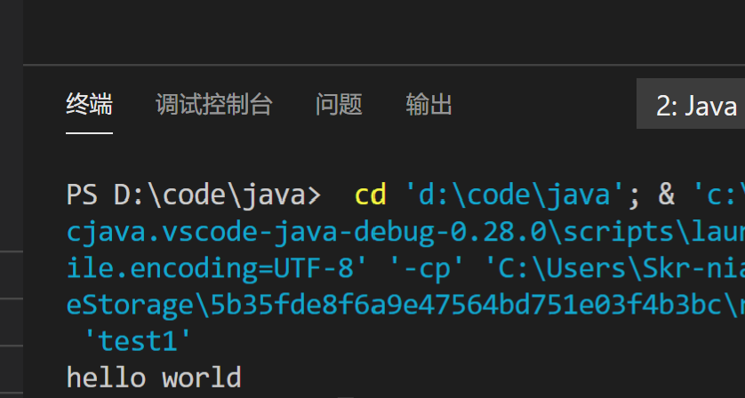

## 下载JDK

从Oracle[官网](https://www.oracle.com/java/technologies/javase-downloads.html)下载JDK开发包
[JDK8](https://www.oracle.com/webapps/redirect/signon?nexturl=https://download.oracle.com/otn/java/jdk/8u261-b12/a4634525489241b9a9e1aa73d9e118e6/jdk-8u261-windows-x64.exe)

---

[JDK14](https://www.oracle.com/java/technologies/javase-jdk14-downloads.html#license-lightbox)

下载好所需版本，双击安装

下一步下一步，直到安装完成

---
#### 检测环境变量

win+R输入cmd并确定

cmd输入Java,回车

如图则显示环境变量安装完成

## 安装Visual Studio Code

[官网](https://code.visualstudio.com/)下载最新版本
安装打开

安装Java Extension

## 调试Java程序

新建Java文件

按F5调试代码

运行成功
